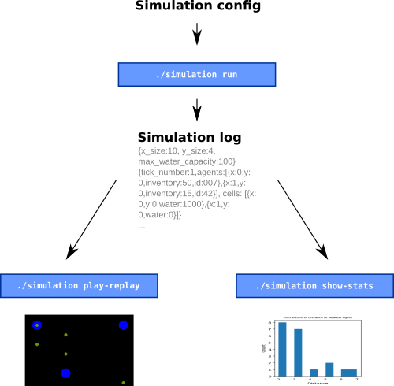

# Overview

This document gives a brief, high-level overview of the system architecture. For an in-depth description of the components, check out the other files in this folder.

The entry point to this program is the `./simulation` script which can run three different commands. `simulation run` takes configuration parameters, and runs a simulation until either all agents are dead, or a configurable turn limit has been reached.

Each simulation run generates a simulation log file in the `logs` directory, which contains the state of the simulation at each turn, and some metadata. In addition to that, error messages and debug information is put into a file in the `debug-logs` directory.

The simulation log file serves as input to two other subsystems, invoked through the `simulation play-replay` and the `simulation show-stats` commands.

`simulation play-replay` visualises the progress of a simulation turn-by-turn, while `simulation show-stats` displays summary statistics.

To learn more about the design of the `run` subsystem, look at `simulation_run.md`. The other two commands are described in `visualisation.md`.

