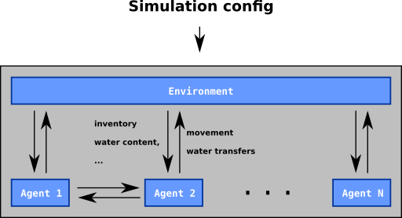

# Subsystem design: simulation run

The simulation runs via the AEA framework. Think of the agents as mars rovers, with sensors and actuators. The sensors allow it to perceive the ground underneath it, while its actuators (motors and drills) allow it to interact with the world.

The simulation is done by two classes of AEAs. Agent-AEAs are the mars rovers. They communicate with each other, trying to find a good strategy to survive. The environment AEA emulates the world. It sends messages which represent input to the sensors, and receives messages corresponding to actuators.

## Simulation goals
The goal of the agents is to survive as long as possible. The idea being that they are stranded on a desert, and use up one unit of water per unit of time. Spread around the desert are water sources. Agents can either mine water from underneath them, pass water to adjacent agents, or move around the desert. The goal is to survive as long as possible as a collective, not as an individual. This software provides a tool for exploring this problem, and tests out three different strategies for survival.

For details on the strategies, see the respective document in this directory.

## Simulation world structure
The world of the simulation takes place on a grid on a torus (2d grid with wraparound). Each grid cell contains a certain amount of water, and at most one agent.

The agents die once their own water, their "inventory", reaches 0. The simulation proceeds in turns. In each turn, each agent uses up one unit of water, and optionally takes some action: It can either move in some direction, or it can prepare to transfer or to receive an amount of water of its choice from one of its neighbours. If the requests and offers for water don't match up, the environment resolves them in an unspecified way. If an agent starts its turn on a grid cell that contains water, it will automaticly extract water, up to a configurable limit. 

## Simulation Lifecycle
Since this subsystem is implemented almost entirely in the AEA framework, a lot of the framework's language will be used here. For more information, please refer to the documentation at docs.fetch.ai. The simulation lifecycle proceeds in the following steps:
1. The `./simulation run` script accepts configuration parameters, and uses the Multi Agent Manager to pass those parameters to the environment's and the agents' skill configuration.
2. The Multi Agent Manager instantiates the required number of agent-AEAs and an Environment-AEA.
3. The Environment-AEA reads the agent's cryptographic addresses from `keys/mapping.json`.
4. The first turn of the simulation begins
  * The environment sends a `tick` message to all the agents, containing the current state of the simulation, as visible from the agents' perspective.
  * The agents communicate with their neighbours to figure out what to do.
  * The agents reply to the `tick` message with a `command` message, indicating their next action.
  * Once the environment has received all the commands, it computes the new state of the simulation, writes it to the simulation log file in `logs/`, and starts the next turn.
5. Once all agents are dead, or a turn limit has been exceeded, the environment creates the file `$SIMULATION_ENDED` in the project root.
6. Once the `./simulation run` script detects that the file is there, it shuts down all agents and the environment, and runs cleanup procedures.

