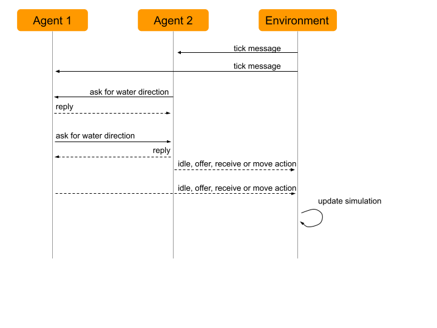

# GDP Strategies
An agent uses one of those strategies to take a decision each turn. 
They help him decide: 
* whether to move or not and where
* whether to offer water to his neighbours or not and how much
* whether to ask for water from his neighbours or not and how much

An agent can take one of the following actions each turn:
* offer water (specifying how much he offers)
* receive water (specifying how much he is willing to receive)
* move (specifying the direction of his move)
* idle 

# Lone Goldfish
The agent will not communicate with its neighbours. 
Hence he won’t ask for water nor offer water to them. 
He doesn’t remember anything. If the cell he is in has water he decides to do nothing hence will automatically drink from it otherwise he decides to move to a random direction.

# Altruistic Goldfish
The agent will ask for water to its neighbours if he is thirsty (thirst level is configurable), and he will share its water if needed and if he has enough not to be thirsty.
If none of the above applies he will move to a random direction.
Schema of the messages exchanged:

# Explorer Dog
The explorer dogs. They're loyal, stubborn, and just a little smart. They actively go out and seek water when they're hydrated, when they are not hydrated, they will ask agents encountered about water directions and return to where they think the closest water is at (could be from info of another agent, could be from previous exploration)

